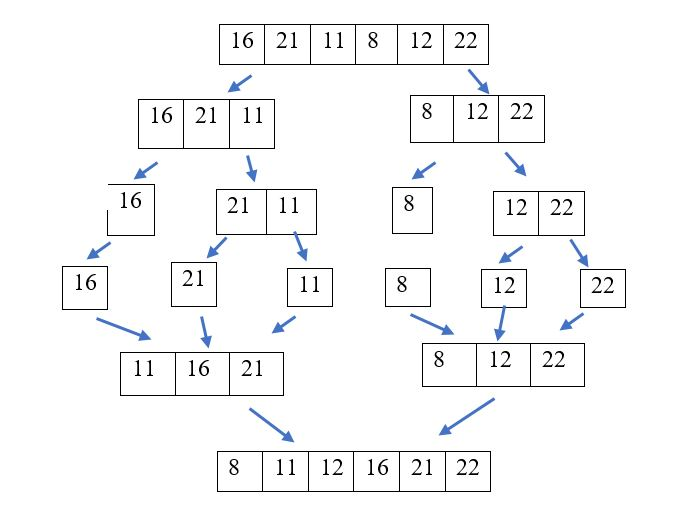

## Merge Sort Projesi

    [16,21,11,8,12,22] -> Merge Sort

1. Yukarıdaki dizinin sort türüne göre aşamalarını yazınız.

---
2. Big-O gösterimini yazınız.

    n+(n-1)+(n-2)+...+1 den Big-O gösterimi O(n^2) olur.<>